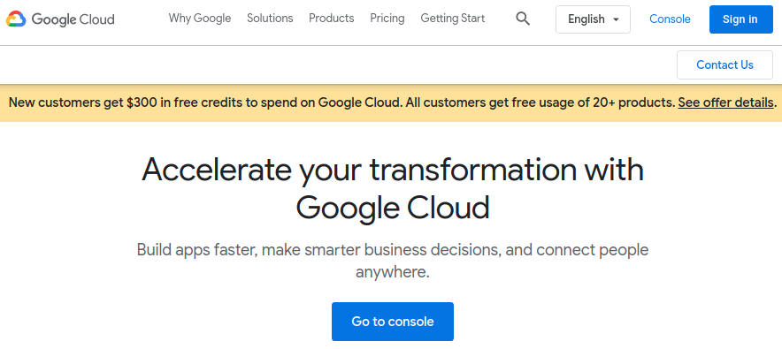
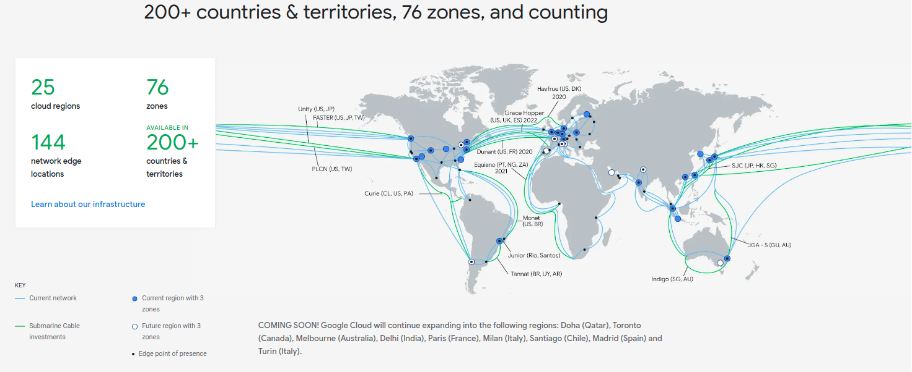
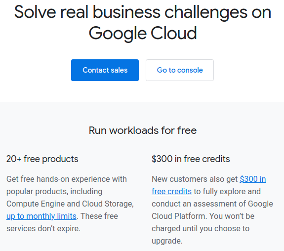
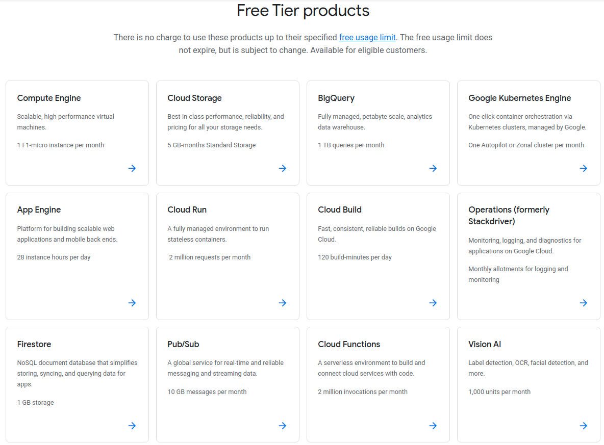
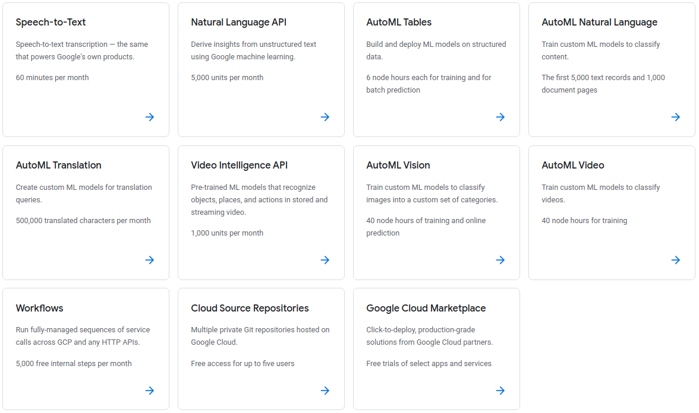
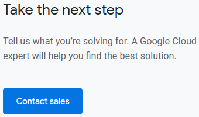
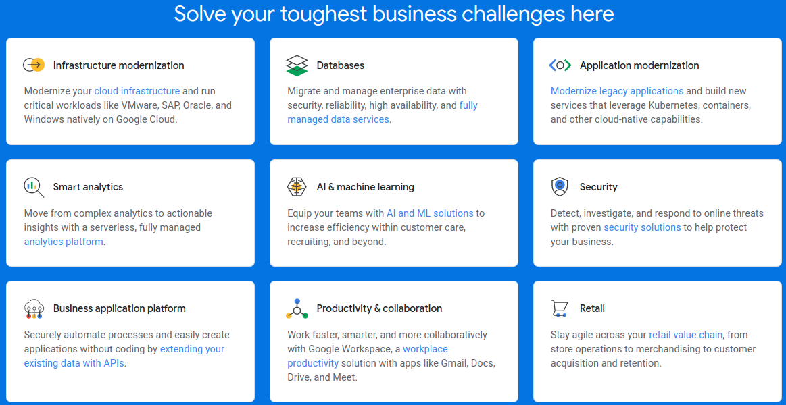
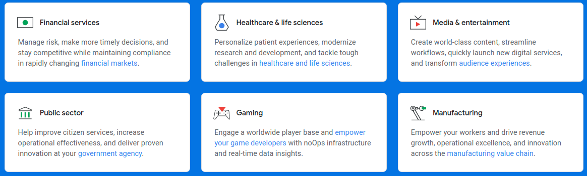
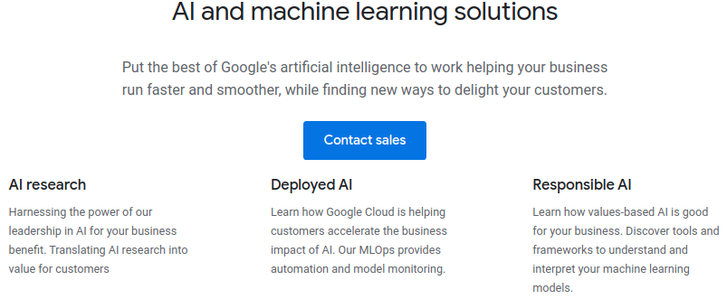
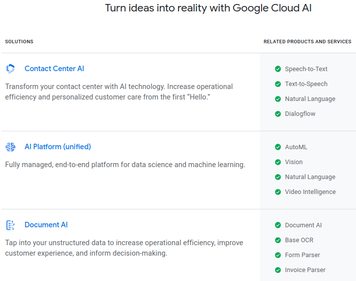

* Draft: 2021-05-17 (Mon)

# Getting Started with Google Cloud Platform

## Google Cloud Homepage

* The homepage is at https://cloud.google.com/. 
* Probably the most import information for the new comer is the free credit.
  * Clicking `See offer details` on the the yellow bar is the first step to get your free credit of 300USD.
  * Refer to [How to Get Started GCP for Free](how_to/1-get_started_gcp_for_free.md) for the step-by-step guide to get the free credit.

## Free Credit

https://cloud.google.com/free

### Free tier products

* A variety of free products are available for testing.
* The free tier products include 
  * basic services
    * Compute Engine, App Engine, 
    * Cloud Storage,
  * popular products
    * BigQuery,
    * Firestore
  * AI & machine learning products
    * Vision AI, Video Intelligence API, 
    * Natural Language API, 
    * Speech-to-Text
    * more specifically AutoML prodcuts
      * AutoML Vision, AutoML Video,
      * AutoML Natural Language, AutoML Translation
      * AutoML Tables

I don't see other popular products such as

* Firebase,
* DataFlow,
* Machine Learning Engine.

## Business challenges

For business challenges, you may contact sales.

The overview of the listed business challenges is below.

### Business challenge: AI & machine learning

Among many business challenges, let's take a closer look at the AI & machine learning challenges available at https://cloud.google.com/solutions/ai.

