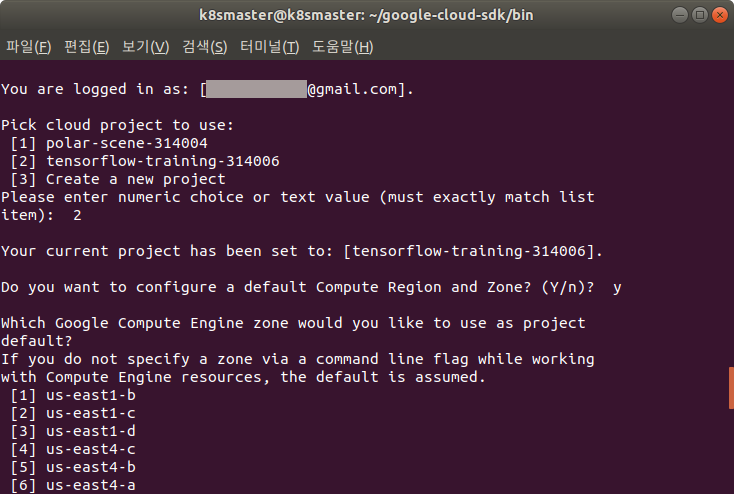

* Rev.1: 2021-05-17 (Mon)
* Draft: 2020-11-24 (Tue)

# Install

## Overview

GCP can be used either with

* a web browser or
* a terminal.

If you prefer using a web browser, installation is not necessary. 

Two options are provided to use GCP on a web browser:

* Cloud console (graphical user interface) 
* Cloud Shell (command-line interface)

Installation of Cloud SDK is necessary if you choose to use a terminal.

## How to install

* To install Cloud Shell, refer to [Installing Google Cloud SDK](https://cloud.google.com/sdk/docs/install). 
* My version of the above document is summarized at [How to Install Google Cloud SDK](how_to/5-install_google_cloud_sdk.md).

