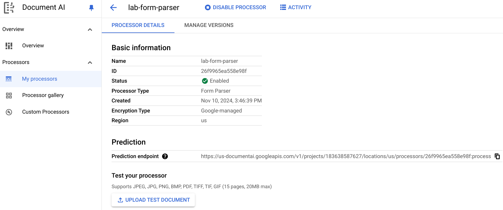
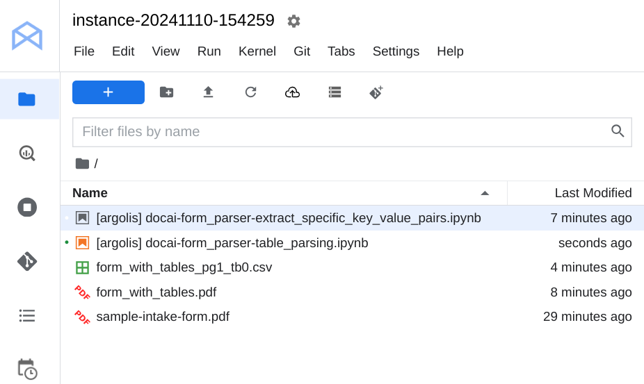

# Form Parsing with Document AI (Python)
* Created 2024-11-10 (Sun)
* Updated 2024-11-10 (Sun)

Source: [Form Parsing with Document AI (Python)](https://www.cloudskillsboost.google/focuses/87654?catalog_rank=%7B%22rank%22%3A3%2C%22num_filters%22%3A0%2C%22has_search%22%3Atrue%7D&parent=catalog&search_id=39347028) [45 mins]

Example: Form Parser > Processor Details

The files after completing the lab

