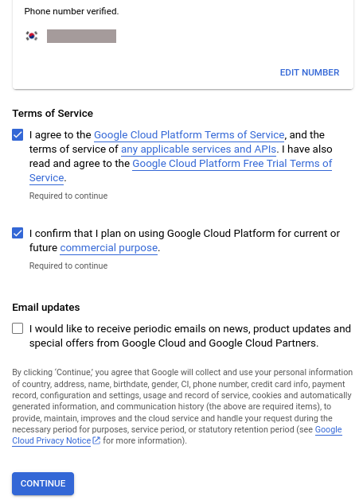
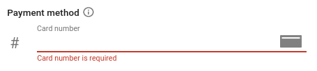
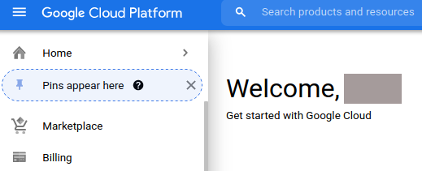
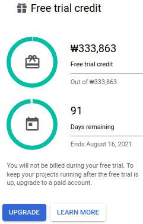

* Draft: 2021-05-17 (Mon)

# How to Get Started GCP for Free

Step 1. Sign in with your Google account.

Step 2. Go to https://cloud.google.com/

Step 3. Click the `Get started for free` button.

You'll be asked to enter some information. Notice `CONTINUE` on the bottom is deactivated. You cannot click it to proceed the next step until the necessary information is entered and verified.

Step 4. Enter the phone number and click `SEND CODE`.

The `Identity verification and contact information ` part will be updated as follows.

Step 5. Check your phone, enter verification code and click `VERIFY`. This part will be updated as follows.

Step 6. Check the box under `Terms of Service` and the `CONTINUE` button will be activated like above.

Step 7. Click the `CONTINUE` button and `Step 2 of 2` will be presented as follows.

Step 8. Enter the necessary information and click the `CONTINUE` button.

Now the `How you pay` part will be presented as follows.

The required information must differ from country to country. The requested information is the typical one in my country. It may be different for you.

Step 9. Enter your personal information and click `SEND CODE`.

> Note
> If the information does not match, you'll be given another change after several seconds. Click `RESEND CODE` if this happens. At my first attempted, `Name` was presented in alphabets which failed. I entered my name in the Hangul characters and it worked fine at the second attempt.

Well, the following part is added below and you'll be required to enter the payment information.

This is going to be the last step. Be patient. You'll get the FREE credit soon.

Step 10. Enter the credit card information.

Finally! the `CONTINUE` button is changed to `START MY FREE TRIAL`.

Step 11. Click the  `START MY FREE TRIAL` button.

At last, the welcome message confirms the process to obtain $300 free credit succeeded! Click `GOT IT` to close the message and the GCP dashboard will be shown as follows.

## Memo

* It was a little bit tiring to enter all the information 
  * (because I had to capture the screen and write this tutorial).
* I am also excited to play with GCP with this free credit.
* I hope you enjoy playing with GCP, too.

## The Dashboard for Google Cloud Console

### Verify the free credit

Click the `Billing` menu on the left to double-check the free credit.

The overview is below. 

On the right bottom corner, the `Free trial credit` is shown.

 This amount is approximately $300 converted to the currency in my country, i.e. KRW.

It's all done! Let's have fun now!!!