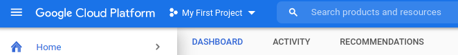
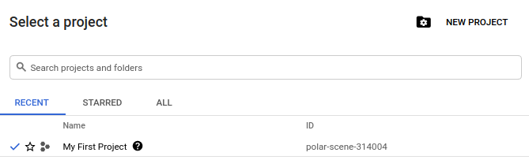
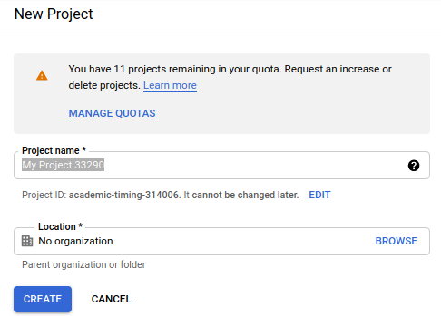
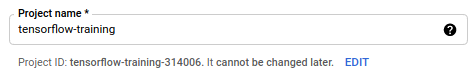
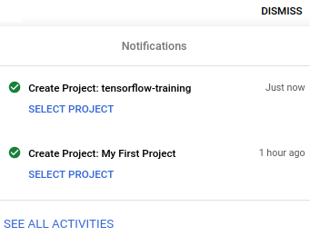
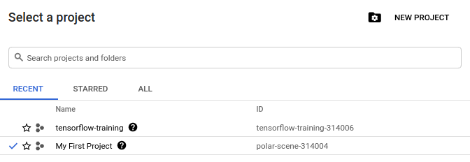
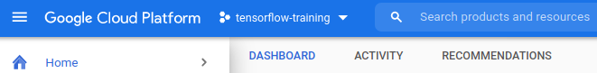

* Draft: 2021-05-17 (Mon)

# How to Create the First Project on GCP

## Create a new project

Step 1. Click `My First Project`.

Step 2. Click `NEW PROJECT` on the top right corner of the pop-up window.

`New Project` window pops up.

Step 3. Enter `Project name`, e.g. `tensorflow-training` and click `CREATE` in the left bottom.

`Notifications` on the GCP dashboard shows the project has been created.

Step 4. Select the create project to work on the project.

To do so, click `My First Project` first.

And `Select a project` page pops up.

Click `tensorflow-training` under `Name` and the project name has been changed to `tensorflow-training` on the top bar.

Now you are in the new project's dashboard. 

You can click through the menus to do what you want to do. For example, you may create a virtual machine (VM) on Google Cloud.

