* Draft: 2021-05-17 (Mon)

# How to Create, Stop, and Delete a Virtual Machine on GCP

## Overview

* GCP's virtual machine (VM) is called Google Compute Engine.
* This page explains how to create a Compute Engine instance on the GCP console.
* Another way to create a VM is to use Google Cloud SDK which will be covered later.

## Steps

### Navigating to the Compute Engine dashboard

Step 1. Go to the GCP console.

Step 2. Find `Compute Engine` in the navigation menu on the left side. It's located under the `COMPUTE` section.

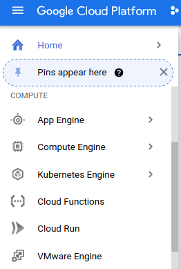

Step 3. Click `Compute Engine`. 

Under this menu, you can create and run virtual machines on GCP. 

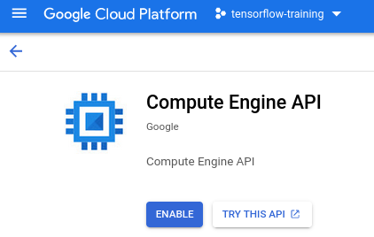

At first, click `ENABLE` and the following page shows up when the API is enabled.

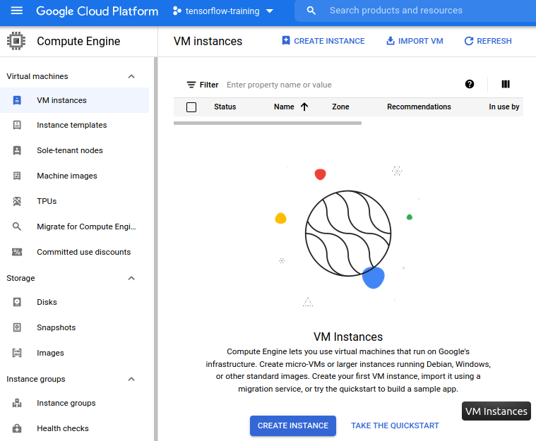

The virtual machine is being provisioned. You will see a green check mark.

## Creating a Compute Engine instance

Step 4. Click `CREATE INSTANCE`.

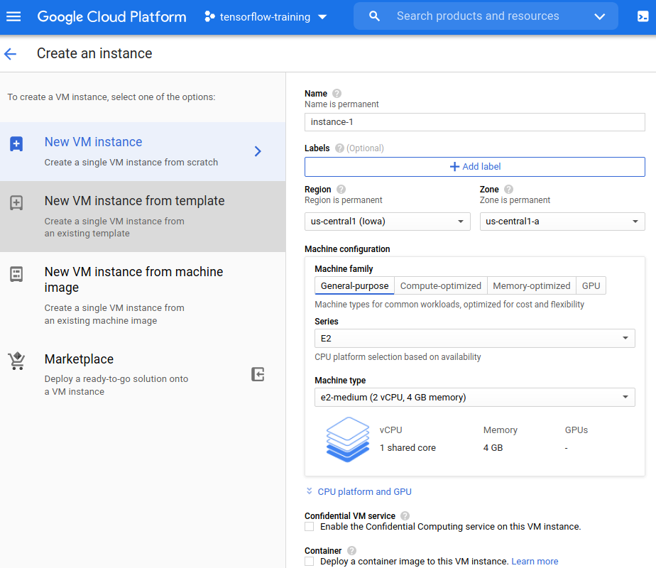

Step 5. Enter `Name`. You can only use

* lowercase letters,
* numbers, and
* hyphens.

`Name must be lowercase letters, numbers, and hyphens `

You may enter, for example, `hello-world`.

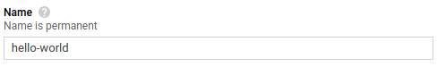

You may use the default settings for the rest of options.  If you prefer using an instance in `Region` closer to you, you may select one. In my case, I selected `Seoul` because I live in Seoul.

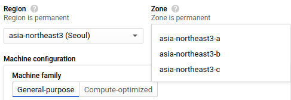

Step 6. Click `Create`.

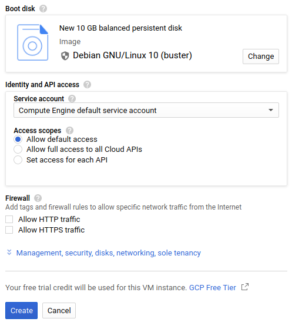

Now `Create an instance` page disappears and the `Status` is spinning which shows the instance is in the process of being created. 

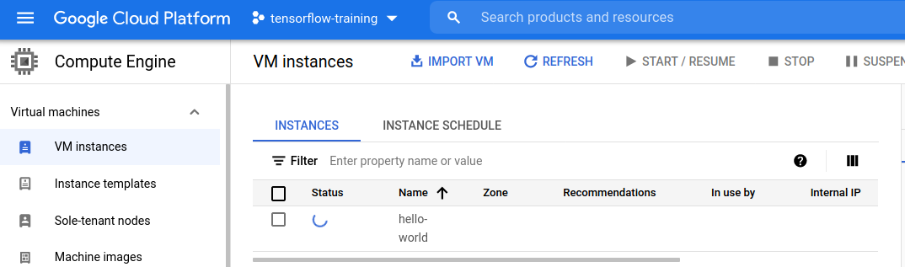

It will take a while until the status is changed to the green check mark.

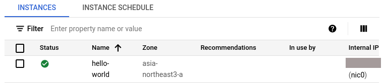

Note your charges will occur from now on because you are accessing the computing resources on GCP.

### Stopping the Compute Engine instance

Let's stop the instance, for now, to save the charges. 

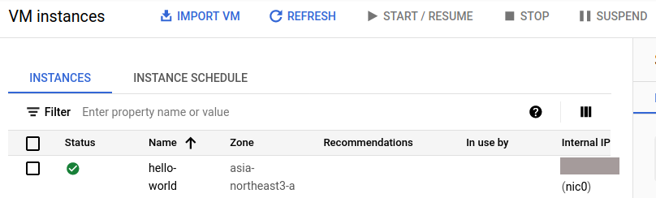

Step 7. Check the instance and click `STOP`.

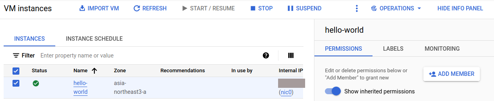

A confirmation window pops up.

Step 8. Click `STOP.

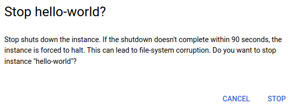

Step 9. Double-check the `Status` has been changed as follows.

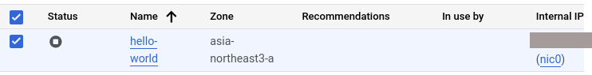

### Deleting the Compute Engine instance

Step 10. Check the instance, click the vertical ellipsis `⋮` , and click`DELETE`.

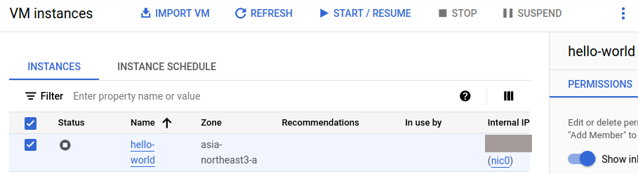

In the above figure, the vertical ellipsis is located on the top right corner of the figure. Clicking it invokes the following menu.

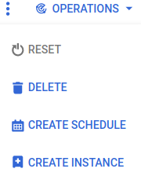

Click `DELETE`.

A confirmation window pops up.

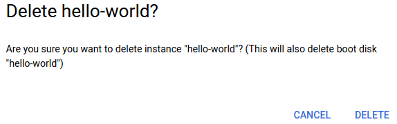

Step 11. Click `DELETE`.

The Compute Engine instance will be deleted in a while.

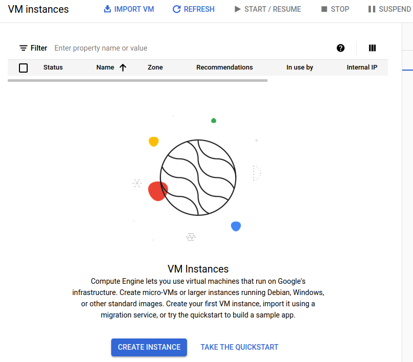