* Draft: 2021-05-17 (Mon)

# How to Install Google Cloud SDK

## Summary

To install on Ubuntu Linux (18.04), run [bash_script/install_google_cloud_sdk](bash_script/install_google_cloud_sdk). 

Equivalently, you may run the following commands manually.

```bash
$ python --version
$ curl -O https://dl.google.com/dl/cloudsdk/channels/rapid/downloads/google-cloud-sdk-340.0.0-linux-x86_64.tar.gz
$ tar -xvf google-cloud-sdk-340.0.0-linux-x86_64.tar.gz
$ ./google-cloud-sdk/install.sh
$ ./google-cloud-sdk/bin/gcloud init
```

## Overview

### https://cloud.google.com/sdk

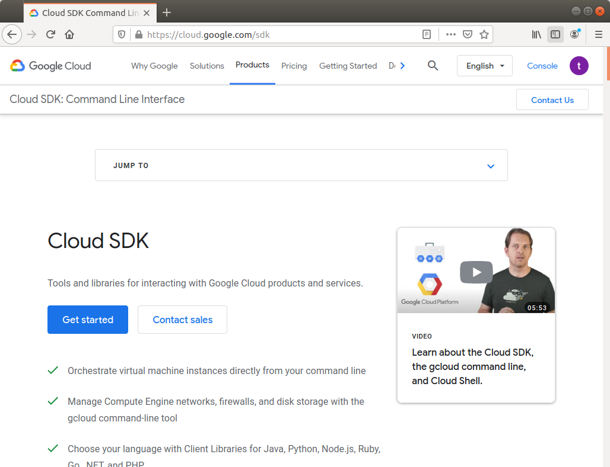

### [Installing Google Cloud SDK](https://cloud.google.com/sdk/docs/install) on Windows

> * Step 1. Download the Cloud SDK installer.
> * Step 2. Launch the installer and follow the prompts.
> 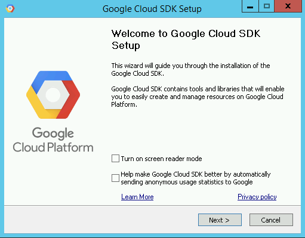

> * Step 3. Cloud SDK requires Python; supported versions are Python 3 (preferred, 3.5 to 3.8) and Python 2 (2.7.9 or higher).
> The installer will install all necessary dependencies, including the needed Python version. While Cloud SDK currently uses Python 3 by default, you can use an existing Python installation if necessary by unchecking the option to Install Bundled Python.

> Step 4. After installation has completed, the installer presents several options:

> 

If you check the App menu, you'll be able to find `Cloud Tools for PowerShell` and `Google Cloud SDK Shell`.

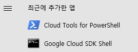

> Make sure that the following are selected:
> * Start Google Cloud SDK Shell
> * Run gcloud init
>   * The installer starts a terminal window and runs the gcloud init command.

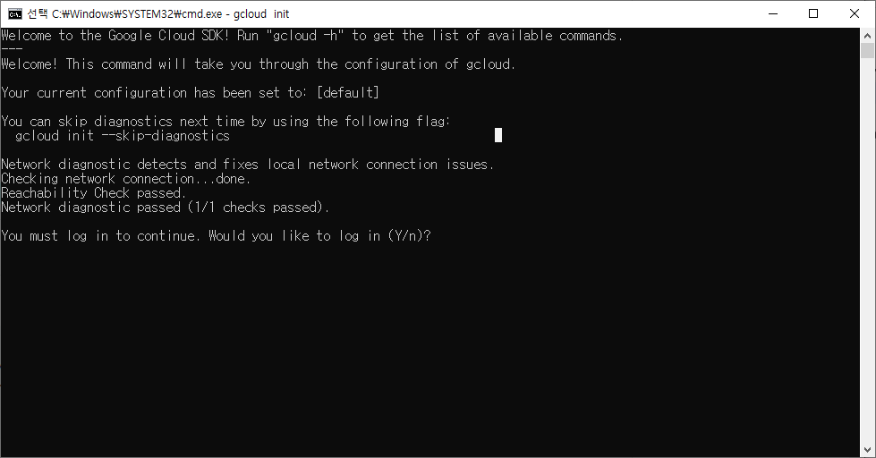

### [Installing Google Cloud SDK](https://cloud.google.com/sdk/docs/install) on Linux
The installation manual explains the process in details.

#### Step 1. Check the Python version.

```bash
$ python --version
Python 3.8.5
$
```

#### Step 2. Select the platform suitable for you.

For Linux,

| Platform              | Package                                                      | Size    | SHA256 Checksum                                              |
| --------------------- | ------------------------------------------------------------ | ------- | ------------------------------------------------------------ |
| Linux 64-bit (x86_64) | [google-cloud-sdk-340.0.0-linux-x86_64.tar.gz](https://dl.google.com/dl/cloudsdk/channels/rapid/downloads/google-cloud-sdk-340.0.0-linux-x86_64.tar.gz) | 85.1 MB | f2ae79ff55a3bbe700208ccdde49c2fd5511c03016e3a09f69257ffdd6a6a9d6 |
| Linux 32-bit (x86)    | [google-cloud-sdk-340.0.0-linux-x86.tar.gz](https://dl.google.com/dl/cloudsdk/channels/rapid/downloads/google-cloud-sdk-340.0.0-linux-x86.tar.gz) | 82.5 MB | 0446d7fd770601389c878640c8749d6336f3097c5e99005d5eab4b911343baf1 |

#### Step 3. Download the installation package.

For Linux 64-bit (x86_64), the download command is as follows.

```bash
$ curl -O https://dl.google.com/dl/cloudsdk/channels/rapid/downloads/google-cloud-sdk-340.0.0-linux-x86_64.tar.gz
```

The above command downloads a compressed file.

```bash
$ ls
google-cloud-sdk-340.0.0-linux-x86_64.tar.gz
$
```

If your platform is different, choose the right one and change the package file name accordingly.

#### Step 4. Extract the compressed file.

```bash
$ tar -xvf google-cloud-sdk-340.0.0-linux-x86_64.tar.gz
```

The files are extracted to the `google-cloud-sdk` directory.

```bash
$ cd ~/google-cloud-sdk
$ ls
LICENSE  README  RELEASE_NOTES  VERSION  bin  completion.bash.inc  completion.zsh.inc  data  deb  install.bat  install.sh  lib  path.bash.inc  path.fish.inc  path.zsh.inc  platform  properties  rpm
$ tree
  ...
3016 directories, 14516 files
$
```

#### Step 5. Install `google-cloud-sdk` with the `install.sh` script.

```bash
$ ./google-cloud-sdk/install.sh
```

This script expects three interactions.

```bash
  ...
Do you want to help improve the Google Cloud SDK (y/N)? 
```

Enter `y` or `n`.

```bash
  ...
Modify profile to update your $PATH and enable shell command 
completion?

Do you want to continue (Y/n)?
```

Enter `y`.

```bash
Enter a path to an rc file to update, or leave blank to use 
[/home/aimldl/.bashrc]: 
```

Finally, hit the `Enter` key.

```bash
  ...
For more information on how to get started, please visit:
 https://cloud.google.com/sdk/docs/quickstarts
$
```

#### Step 6. Initialize Google Cloud

Run the `gcloud init` command to initialize the SDK.

```bash
$ ./google-cloud-sdk/bin/gcloud init
```

The initial interaction occurs at the terminal.

```bash
You must log in to continue. Would you like to log in (Y/n)?
```

Enter `y` and a web browser will pop up. The rest of interactions happen on the web browser and your phone.

Click the Google account you wish to connect with GCP.

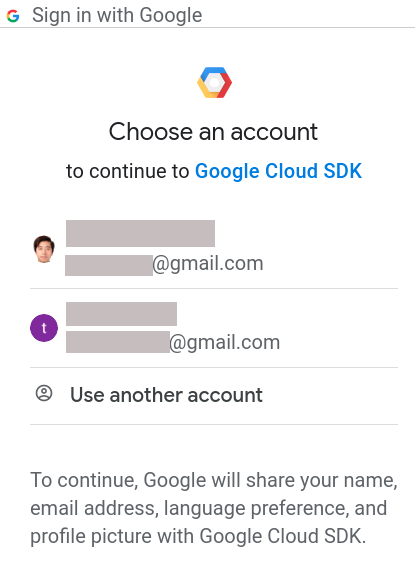

If you click `Use another account`, enter your Gmail account to sign in and click `Next`.

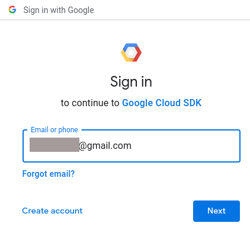

The verification process is necessary. I guess your preferred method will be used. In my case, I have to use my phone. At this time, a verification code is sent. Previously, I had to open Gmail for your reference.

If you have already verified the computer you're using, the verification step will be skipped. When I've verified my Gmail account on a new machine and installed the Cloud SDK, no verification step was necessary.

Click `Send`.

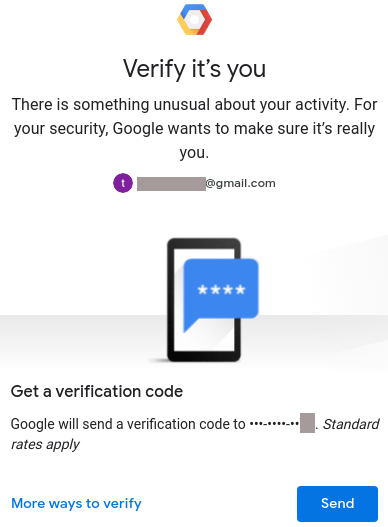

Check your phone and enter the verification code.

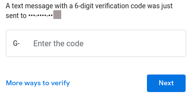

Click `Allow` .

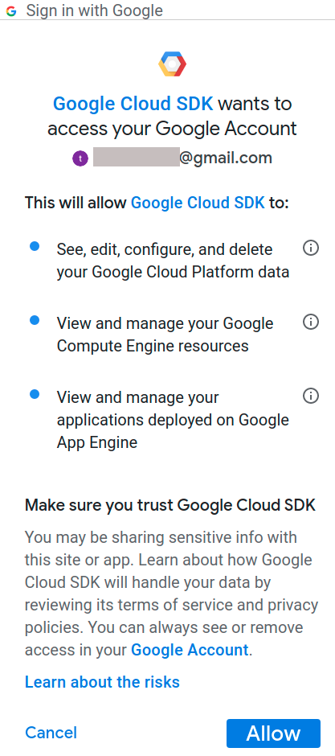

Success!

On your web browser, the following message is shown (https://cloud.google.com/sdk/auth_success).

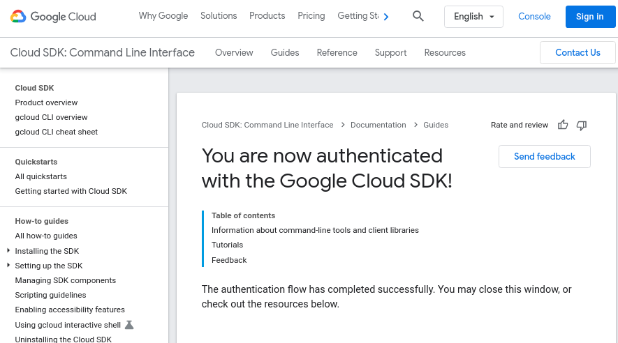

In the terminal, you will see something like this.

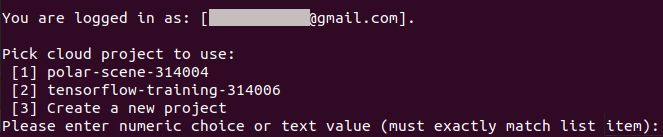

#### Step 7. Start using the Cloud SDK.

The Cloud SDK is installed and authenticated. Now you're ready to use it.
