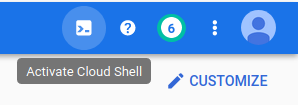
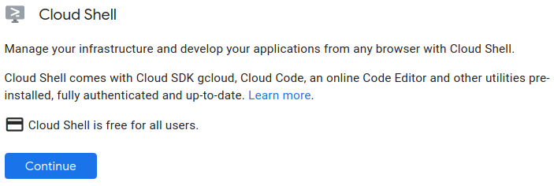
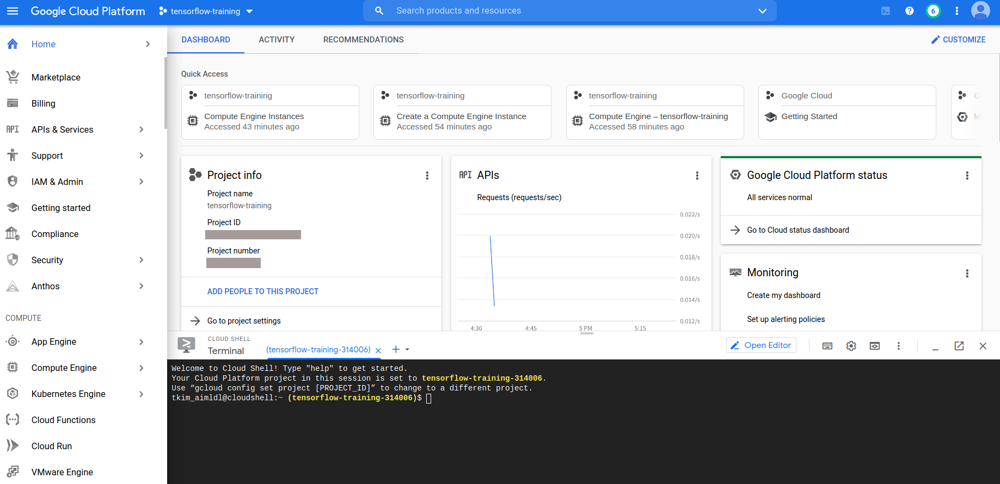
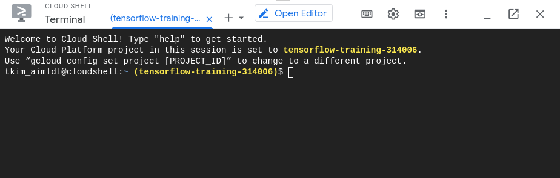

* Draft: 2021-05-17 (Mon)

# How to Activate Cloud Shell

## Overview

Cloud shell

*  is a handy alternative way to the GCP SDK if you prefer using the command line interface (CLI).
* lets you manage your GCP infrastructure and applications
  * from the command line
  * in any web browser.
  * without installing the SDK on your local machine.
* comes with 
  * a small persistent disk and
  * the basic software such as
    * GCP SDK
    * Git
    * Python
    * and more

## Activating the cloud shell

Step 1. Go to the GCP console.

Step 2. Find the `Activate Cloud Shell` icon on the top right corner of the console home.

Step 3. Click the icon and the following message pops up.

Step 4. Click `Continue`.

And the cloud shell terminal shows up on the bottom of the console home.

Step 5. Use the terminal.

