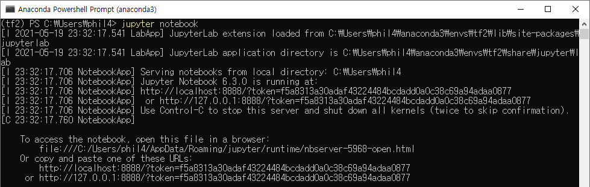

* Draft: 2021-05-19 (Wed)

# How to Configure Your Local Machines

## Summary

conda create -n tf2 python=3 anaconda -y

conda activate tf2

pip install --upgrade pip --user

pip install tensorflow

python -c 'import tensorflow as tf; print(tf.__version__)'

* Install Anaconda and create a new virtual environment, e.g. `tf2`.

```bash
(base) conda create -n tf2 python=3 anaconda -y
#
# To activate this environment, use
#
#     $ conda activate tf2
#
# To deactivate an active environment, use
#
#     $ conda deactivate
(base) conda activate tf2
(tf2) 
```

* After activating the new Conda virtual environment, e.g. `tf2`, upgrade `pip` and install `tensorflow`. TensorFlow 2.x will be installed if your situation allows.

```bash
(tf2) pip install --upgrade pip --user
(tf2) pip install tensorflow
(tf2) 
```

* Check the installed TensorFlow version.

```bash
(tf2) python -c 'import tensorflow as tf; print(tf.__version__)'
2.5.0
(tf2) 
```

* Run `jupyter notebook` if you'd like to use it.

```bash
(tf2) jupyter notebook
```

## Problem

Without TensorFlow on your machine, you will see `ModuleNotFoundError` as follows.


Let's fix it by installing TensorFlow. Then you'll see the TensorFlow version in the same Jupyter Notebook.


## Solution

### On Windows machine

The following part is tested on Windows 10.

Step 1. Install Anaconda

Step 2. Verify the installed programs.


Step 3. Open `Anaconda Powershell Prompt`.

Step 4. Create a new Conda virtual environment.
        The name is set to `tf2`, but you may choose one you like.

```powershell
(base) PS  C:\Users\aimldl> conda create -n tf2 python=3 anaconda
```
Enter `y` to proceed.
```powershell
  ...
Proceed ([y]/n)?
  ...
# To activate this environment, use
#
#     $ conda activate tf2
#
# To deactivate an active environment, use
#
#     $ conda deactivate

(base) PS C:\Users\aimldl> 
```

Step 5. Activate the created environment.
```powershell
(base) PS C:\Users\aimldl> conda activate tf2
(tf2) PS C:\Users\aimldl>
```
From now on `(tf(tf2) $ jupyter notebook2) > ` will be used instead of (tf2) PS C:\Users\aimldl> for simplicity.
```powershell
(tf2) > pip install --upgrade pip --user
```
The `--user` option is used because the permission error may occur.

Step 6. Let's check the GPU.
```powershell
(tf2) > nvidia-smi
Wed May 19 22:39:03 2021
+-----------------------------------------------------------------------------+
| NVIDIA-SMI 456.71       Driver Version: 456.71       CUDA Version: 11.1     |
|-------------------------------+----------------------+----------------------+
| GPU  Name            TCC/WDDM | Bus-Id        Disp.A | Volatile Uncorr. ECC |
| Fan  Temp  Perf  Pwr:Usage/Cap|         Memory-Usage | GPU-Util  Compute M. |
|===============================+======================+======================|
|   0  GeForce GTX 1080   WDDM  | 00000000:01:00.0  On |                  N/A |
|  0%   37C    P8     8W / 200W |    757MiB /  8192MiB |      0%      Default |
+-------------------------------+----------------------+----------------------+

+-----------------------------------------------------------------------------+
| Processes:                                                                  |
|  GPU   GI   CI        PID   Type   Process name                  GPU Memory |
|        ID   ID                                                   Usage      |
|=============================================================================|
|    0   N/A  N/A      1228    C+G   Insufficient Permissions        N/A      |
|    0   N/A  N/A      1640    C+G   ...ram Files\XMind\XMind.exe    N/A      |
|    0   N/A  N/A      2052    C+G   ...me\Application\chrome.exe    N/A      |
|    0   N/A  N/A      3136    C+G   ...lPanel\SystemSettings.exe    N/A      |
|    0   N/A  N/A      3960    C+G   ...bbwe\Microsoft.Photos.exe    N/A      |
|    0   N/A  N/A      6180    C+G   C:\Windows\explorer.exe         N/A      |
|    0   N/A  N/A      6832    C+G   ...ropbox\Client\Dropbox.exe    N/A      |
|    0   N/A  N/A      7248    C+G   ...5n1h2txyewy\SearchApp.exe    N/A      |
|    0   N/A  N/A      8000    C+G   ...ekyb3d8bbwe\YourPhone.exe    N/A      |
|    0   N/A  N/A      9120    C+G   ...nputApp\TextInputHost.exe    N/A      |
|    0   N/A  N/A      9792    C+G   ...wekyb3d8bbwe\Video.UI.exe    N/A      |
|    0   N/A  N/A     10808    C+G   ...b3d8bbwe\WinStore.App.exe    N/A      |
|    0   N/A  N/A     10880    C+G   ...y\ShellExperienceHost.exe    N/A      |
+-----------------------------------------------------------------------------+
(tf2) > 
```
Step 7. Install TensorFlow

[Install TensorFlow](https://www.tensorflow.org/install) > [GPU support](https://www.tensorflow.org/install/gpu)
> Pip package
> See the pip install guide for available packages, systems requirements, and instructions. The TensorFlow pip package includes GPU support for CUDA®-enabled cards:
> ```
> pip install tensorflow
> ```

```powershell
 (tf2) > pip install tensorflow
   ...
Installing collected packages: pyasn1, rsa, pyasn1-modules, oauthlib, cachetools, requests-oauthlib, google-auth, tensorboard-plugin-wit, tensorboard-data-server, protobuf, numpy, markdown, grpcio, google-auth-oauthlib, absl-py, termcolor, tensorflow-estimator, tensorboard, opt-einsum, keras-preprocessing, keras-nightly, h5py, google-pasta, gast, flatbuffers, astunparse, tensorflow                                          Attempting uninstall: numpy                                                                                                                                                                                           Found existing installation: numpy 1.20.1                                                                                                                                                                           Uninstalling numpy-1.20.1:                                                                                                                                                                                            Successfully uninstalled numpy-1.20.1                                                                                                                                                                           Attempting uninstall: h5py                                                                                                                                                                                            Found existing installation: h5py 2.10.0                                                                                                                                                                            Uninstalling h5py-2.10.0:                                                                                                                                                                                             Successfully uninstalled h5py-2.10.0                                                                                                                                                                          Successfully installed absl-py-0.12.0 astunparse-1.6.3 cachetools-4.2.2 flatbuffe(tf2) > rs-1.12 gast-0.4.0 google-auth-1.30.0 google-auth-oauthlib-0.4.4 google-pasta-0.2.0 grpcio-1.34.1 h5py-3.1.0 keras-nightly-2.5.0.dev2021032900 keras-preprocessing-1.1.2 markdown-3.3.4 numpy-1.19.5 oauthlib-3.1.0 opt-einsum-3.3.0 protobuf-3.17.0 pyasn1-0.4.8 pyasn1-modules-0.2.8 requests-oauthlib-1.3.0 rsa-4.7.2 tensorboard-2.5.0 tensorboard-data-server-0.6.1 tensorboard-plugin-wit-1.8.0 tensorflow-2.5.0 tensorflow-estimator-2.5.0 termcolor-1.1.0
(tf2) > 
```
Step 8. Start using TensorFlow, Jupyter Notebook, and other programs in the Conda virtual environment.

* How to open Jupyter Notebook
  1. Open `Anaconda PowerShell Prompt`
  2. Run `jupyter notebook` in the prompt

```powershell
(tf2) > jupyter notebook
```



and a web browser launches with Jupyter Notebook.


Now start using Jupyter Notebook.

### On Ubuntu Linux (18.04)

* Install Anaconda and create a new virtual environment, e.g. `tf2`.

```bash
(base) $ conda create -n tf2 python=3 anaconda
#
# To activate this environment, use
#
#     $ conda activate tf2
#
# To deactivate an active environment, use
#
#     $ conda deactivate
(base) $ conda activate tf2
(tf2) $
```

* After activating the new Conda virtual environment, e.g. `tf2`, upgrade `pip` and install `tensorflow`. TensorFlow 2.x will be installed if your situation allows.

```bash
(tf2) $ pip install --upgrade pip --user
(tf2) $ pip install tensorflow
(tf2) $
```

* Check the installed TensorFlow version.

```bash
(tf2) $ python -c 'import tensorflow as tf; print(tf.__version__)'
2.5.0
(tf2) $
```

* Run `jupyter notebook` if you'd like to use it.

```bash
(tf2) $ jupyter notebook
```

## 