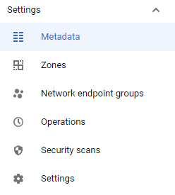
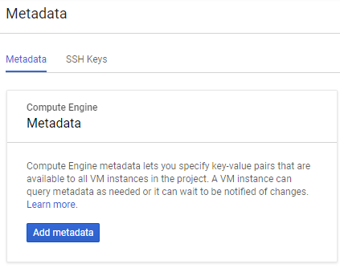
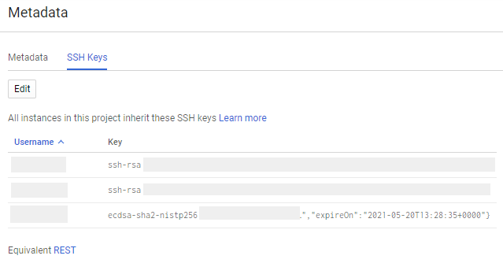
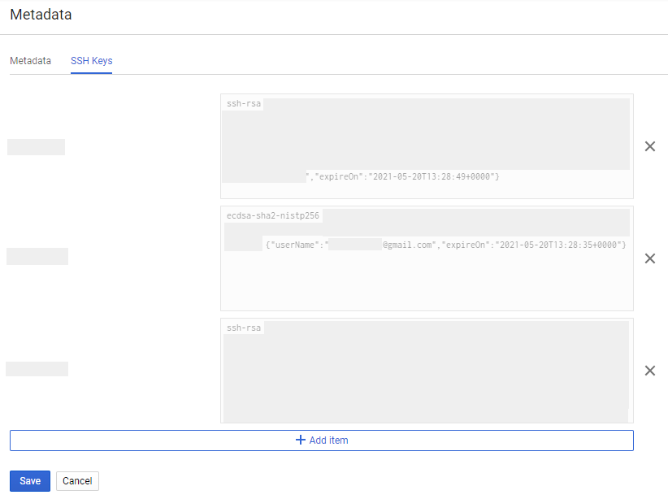
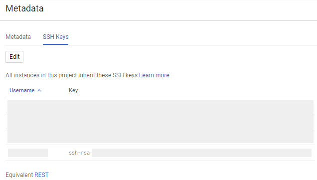
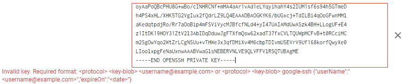
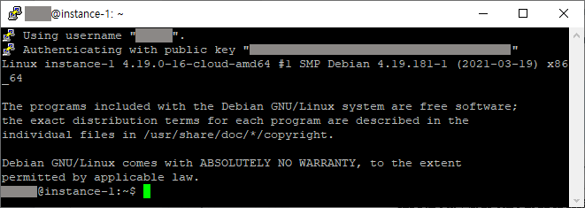

* Draft: 2021-05-21 (Fri)

# Remote-accessing to the Compute instance


## Generate a new SSH key with ssh-keygen

Refer to [Google Cloud](https://cloud.google.com/) > [Compute Engine](https://cloud.google.com/compute) > [Documentation](https://cloud.google.com/compute/docs) > [Guides](https://cloud.google.com/compute/docs/quickstart-linux) > [Managing SSH keys in metadata](https://cloud.google.com/compute/docs/instances/adding-removing-ssh-keys#linux-and-macos) > [Creating a new SSH key](https://cloud.google.com/compute/docs/instances/adding-removing-ssh-keys#createsshkeys)

### Windows

It is assumed that you have installed `Cloud Tools for PowerShell` on your machine. Run the following command

```powershell
ssh-keygen -t rsa -f ~/.ssh/[KEY_FILENAME] -C [USERNAME]
chmod 400 ~/.ssh/[KEY_FILENAME]
```

For example,

```powershell
> ssh-keygen -t rsa -f gcp-public_key -C user_id
Generating public/private rsa key pair.
Enter passphrase (empty for no passphrase):
Enter same passphrase again:
Your identification has been saved in gcp-public_key.
Your public key has been saved in gcp-public_key.pub.
The key fingerprint is:
SHA256:rxCWn/TmXrqIWD/wukMmFAf+/XGY8h6g1gLHyt8CDc8 user_id
The key's randomart image is:
+---[RSA 3072]----+
|    ..           |
|   .. .          |
|    .o           |
|    oo o   o     |
|   ..=B S + .    |
|   .o=E* O o     |
|    o=*o+ B .    |
|     =o*o* +     |
|    . ===o*.     |
+----[SHA256]-----+
> cat .\gcp-public_key-1.pub
ssh-rsa ...
        ...
        ... = user_id
>
```

### Copy the generated public key to Cloud Console.

Open a web browser, go to Google Cloud Platform, and sign in.

Click `Console`.

In the navigation menu (on the left), click `Compute Engine`. Inside the `Compute Engine`'s menu, click `Metadata` under `Settings`.



Click the `SSH Keys` tab.



Click `Edit`



and the SSH key information can be editted.



Click `Add item`, enter public SSH key and click the `Save` button.


A key is added as follows:




If you happen to paste a private key, you will see an error message like this.



## Remote-access the Compute instance

[Connecting to VMs > gcloud](https://cloud.google.com/compute/docs/instances/connecting-to-instance#gcloud)

> Use the [`gcloud compute ssh` command](https://cloud.google.com/sdk/gcloud/reference/compute/ssh) to connect to instances that you have permission to access:
>
> * If you have [set default properties](https://cloud.google.com/compute/docs/gcloud-compute#default-properties) for the `gcloud` command-line tool, 
>
> ```bash
> gcloud compute ssh VM_NAME
> ```
>
> * Otherwise
>
> ```
> gcloud compute ssh --project=PROJECT_ID --zone=ZONE VM_NAME
> ```
>
> - `PROJECT_ID`: the ID of the project that contains the instance
> - `ZONE`: the name of the zone in which the instance is located
> - `VM_NAME`: the name of the instance

### Windows

In `Cloud Tools for PowerShell`, run the following command to remote-access `instance-1`

```powershel
> gcloud compute ssh instance-1
```

and the resulting message looks something like this

```powershell
Updating project ssh metadata...⠹Updated [https://www.googleapis.com/compute/v1/projects/my-project-123456].
Updating project ssh metadata...done.
Waiting for SSH key to propagate.
The server's host key is not cached in the registry. You
have no guarantee that the server is the computer you
think it is.
The server's ssh-ed25519 key fingerprint is:
  ...
If you trust this host, enter "y" to add the key to
PuTTY's cache and carry on connecting.
If you want to carry on connecting just once, without
adding the key to the cache, enter "n".
If you do not trust this host, press Return to abandon the
connection.
Store key in cache? (y/n)
```

A pop-up window shows up as well.



```powershell
~$ gedit temp.txt &
[1] 5217
phil4@instance-1:~$ Unable to init server: Could not connect: Connection refused

(gedit:5217): Gtk-WARNING **: 09:26:23.263: cannot open display:

```


## Appendix

### Private key generation with `ssh-keygen`

If you enter the `ssh-keygen` command without arguments, a private key is generated.

```powershell
> ssh-keygen
Generating public/private rsa key pair.
Enter file in which to save the key (C:\Users\aimldl/.ssh/id_rsa):
Enter passphrase (empty for no passphrase):
Enter same passphrase again:
Your identification has been saved in C:\Users\aimldl/.ssh/id_rsa.
Your public key has been saved in C:\Users\aimldl/.ssh/id_rsa.pub.
The key fingerprint is:
SHA256:sM64X6B9x4iVVMidPrE4FvliZson5pIpIPlt3SxhxGY phil4@DESKTOP-QEVTRA5
The key's randomart image is:
+---[RSA 3072]----+
|       . +..     |
|        =.+      |
|     .. .= o     |
|      E+O.=      |
| .   =o*So .     |
|+    *B+.o       |
|.o .oB=*+ o      |
|  o *.+oo.       |
|   o.o..         |
+----[SHA256]-----+
>
```

Note this private SSH key won't work for Google Cloud Platform as it requests to enter a public SSH key.

## Error message with ssh

```powershell
> ssh aimldl@12.34.567.89
The authenticity of host '12.34.567.89 (12.34.567.89)' can't be established.
  ...
aimldl@12.34.567.89: Permission denied (publickey).
>
```

## Error message with `gloud`

```powershell
> gcloud compute ssh --project=tensorflow-training --zone=asia-northeast3-a instance-1
WARNING: The private SSH key file for gcloud does not exist.
WARNING: The public SSH key file for gcloud does not exist.
WARNING: The PuTTY PPK SSH key file for gcloud does not exist.
WARNING: You do not have an SSH key for gcloud.
WARNING: SSH keygen will be executed to generate a key.
API [compute.googleapis.com] not enabled on project [1038948394581].
Would you like to enable and retry (this will take a few minutes)?
(y/N)?  yes

Enabling service [compute.googleapis.com] on project [1234567890123]...
ERROR: (gcloud.compute.ssh) PERMISSION_DENIED: Permission denied to enable service [compute.googleapis.com]
- '@type': type.googleapis.com/google.rpc.PreconditionFailure
  violations:
  - subject: '110002'
    type: googleapis.com
- '@type': type.googleapis.com/google.rpc.ErrorInfo
  domain: serviceusage.googleapis.com
  reason: AUTH_PERMISSION_DENIED
>
```

