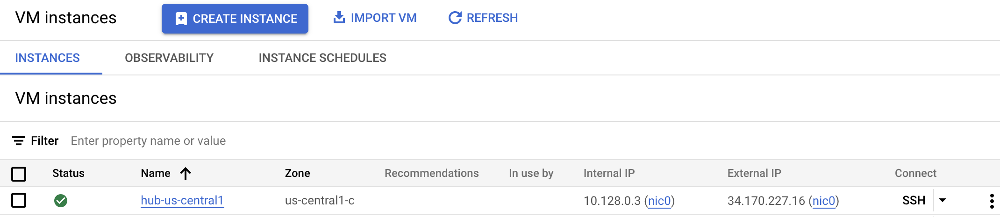

```bash
$ ./create_a_hub_vm
```
```
REGION=us-central1
Setting the associated variables automatically...
gcloud compute instances create hub-us-central1 --project=llm-env --zone=us-central1-c --machine-type=e2-medium --image-family=ubuntu-minimal-2204-lts --image-project=ubuntu-os-cloud --network-interface=network-tier=PREMIUM,stack-type=IPV4_ONLY,subnet=custom-subnetwork-us-central1
Created [https://www.googleapis.com/compute/v1/projects/llm-env/zones/us-central1-c/instances/hub-us-central1].
NAME: hub-us-central1
ZONE: us-central1-c
MACHINE_TYPE: e2-medium
PREEMPTIBLE: 
INTERNAL_IP: 10.128.0.3
EXTERNAL_IP: 34.170.227.16
STATUS: RUNNING

Waiting until hub-us-central1 is created...
Instance hub-us-central1 is created and running
  ...
```

If you don't see the create VM, click ***REFRESH***.

The rest of the output result is as follows:
```bash
  ...
gcloud compute instances add-tags hub-us-central1 --tags=http-us-central1 --project=llm-env --zone=us-central1-c
Updated [https://www.googleapis.com/compute/v1/projects/llm-env/zones/us-central1-c/instances/hub-us-central1].

gcloud compute instances add-tags hub-us-central1 --project=llm-env --tags=ssh-us-central1 --zone=us-central1-c
Updated [https://www.googleapis.com/compute/v1/projects/llm-env/zones/us-central1-c/instances/hub-us-central1].
$
```
