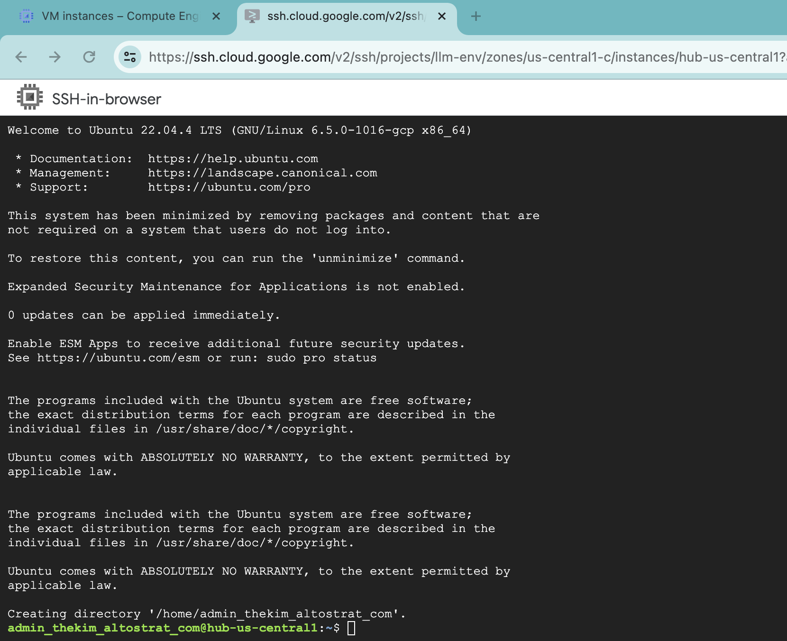

```bash
$ ./init4hub_vm
```

```bash
$ ./create_a_hub_vm
```
```
REGION=us-central1
Setting the associated variables automatically...
gcloud compute instances create hub-us-central1 --project=llm-env --zone=us-central1-c --machine-type=e2-medium --image-family=ubuntu-minimal-2204-lts --image-project=ubuntu-os-cloud --network-interface=network-tier=PREMIUM,stack-type=IPV4_ONLY,subnet=custom-subnetwork-us-central1
Created [https://www.googleapis.com/compute/v1/projects/llm-env/zones/us-central1-c/instances/hub-us-central1].
NAME: hub-us-central1
ZONE: us-central1-c
MACHINE_TYPE: e2-medium
PREEMPTIBLE: 
INTERNAL_IP: 10.128.0.3
EXTERNAL_IP: 34.170.227.16
STATUS: RUNNING

Waiting until hub-us-central1 is created...
Instance hub-us-central1 is created and running
  ...
```

If you don't see the create VM, click ***REFRESH***.

The rest of the output result is as follows:
```bash
  ...
gcloud compute instances add-tags hub-us-central1 --tags=http-us-central1 --project=llm-env --zone=us-central1-c
Updated [https://www.googleapis.com/compute/v1/projects/llm-env/zones/us-central1-c/instances/hub-us-central1].

gcloud compute instances add-tags hub-us-central1 --project=llm-env --tags=ssh-us-central1 --zone=us-central1-c
Updated [https://www.googleapis.com/compute/v1/projects/llm-env/zones/us-central1-c/instances/hub-us-central1].
$
```

## ssh
To see if SSH works, click 

```
$ ./ssh
REGION=us-central1
Setting the associated variables automatically...
gcloud compute ssh hub-us-central1 --project=llm-env --zone=us-central1-c
WARNING: The private SSH key file for gcloud does not exist.
WARNING: The public SSH key file for gcloud does not exist.
WARNING: You do not have an SSH key for gcloud.
WARNING: SSH keygen will be executed to generate a key.
Generating public/private rsa key pair.
Enter passphrase (empty for no passphrase): 
Enter same passphrase again: 
Your identification has been saved in /home/admin_/.ssh/google_compute_engine
Your public key has been saved in /home/admin_/.ssh/google_compute_engine.pub
The key fingerprint is:
SHA256: ...
The key's randomart image is:
+---[RSA 3072]----+
        ...
|       ...       |
        ...
+----[SHA256]-----+
Warning: Permanently added 'compute.0123456789012345678' (ECDSA) to the list of known hosts.
Welcome to Ubuntu 22.04.4 LTS (GNU/Linux 6.5.0-1016-gcp x86_64)

 * Documentation:  https://help.ubuntu.com
 * Management:     https://landscape.canonical.com
 * Support:        https://ubuntu.com/pro


This system has been minimized by removing packages and content that are
not required on a system that users do not log into.

To restore this content, you can run the 'unminimize' command.

Expanded Security Maintenance for Applications is not enabled.

0 updates can be applied immediately.

Enable ESM Apps to receive additional future security updates.
See https://ubuntu.com/esm or run: sudo pro status


The programs included with the Ubuntu system are free software;
the exact distribution terms for each program are described in the
individual files in /usr/share/doc/*/copyright.

Ubuntu comes with ABSOLUTELY NO WARRANTY, to the extent permitted by
applicable law.

Last login: Thu Mar 21 14:17:08 2024 from 34.567.890.12
admin_thekim_altostrat_com@hub-us-central1:~$ ls
snap
admin_thekim_altostrat_com@hub-us-central1:~$ exit
logout
Connection to 12.345.67.89 closed.
admin_@cloudshell:~/git/google_cloud/scripts (llm-env)$
```
